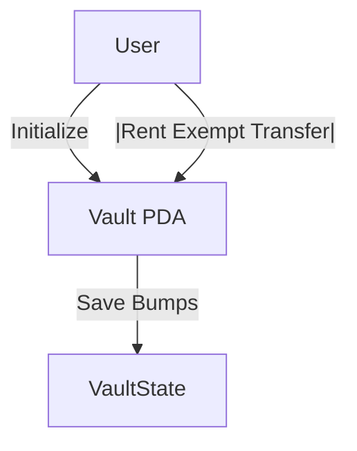
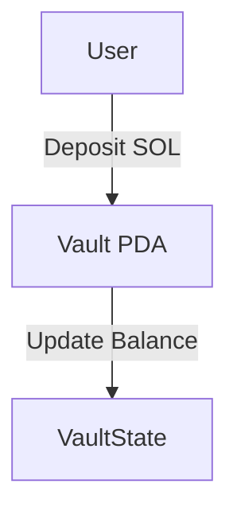
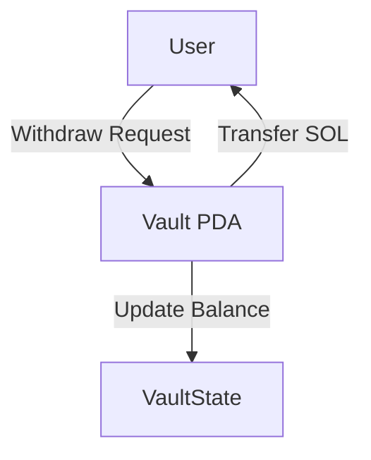
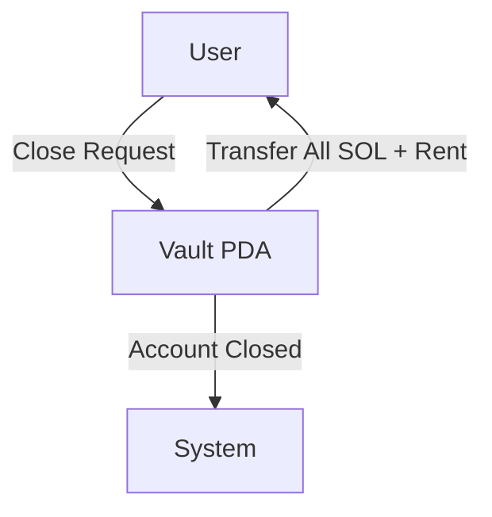
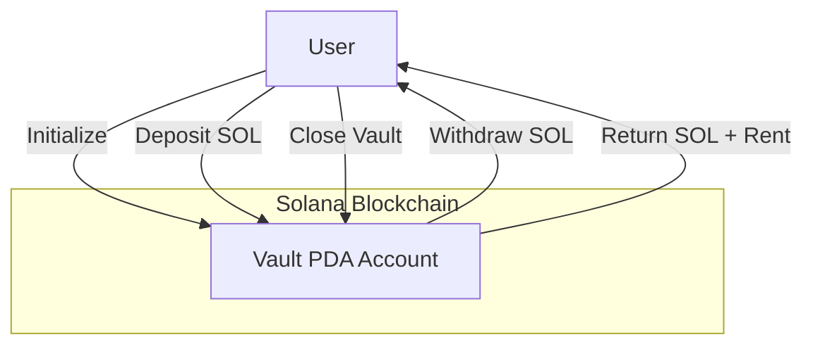
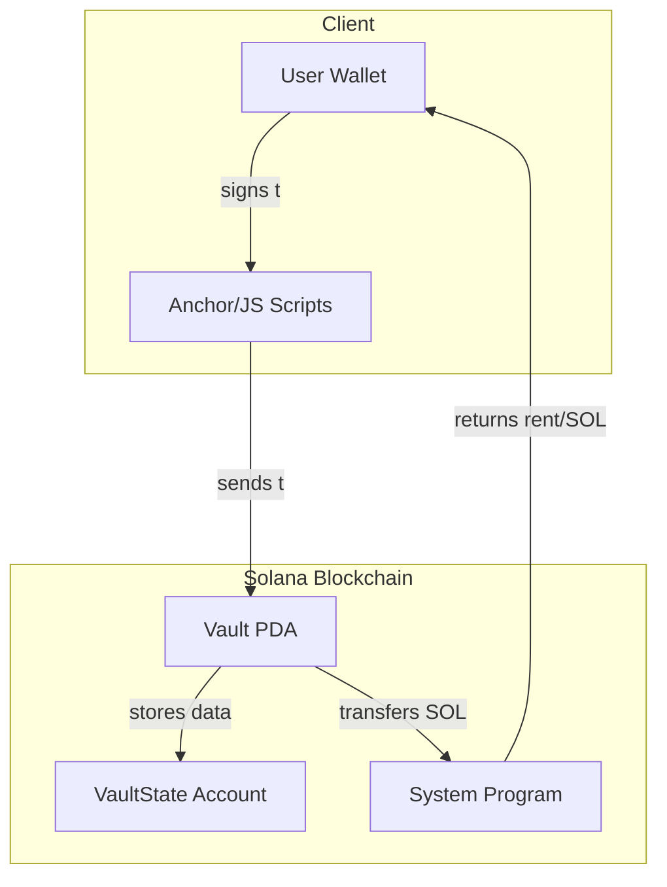

# Solana Vault Program


A simple, secure vault system built on Solana that allows users to safely store, deposit, withdraw, and manage their SOL tokens using Program Derived Addresses (PDAs).

---

## Table of Contents
- [What is Vault?](#what-is-vault)
- [How It Works](#how-it-works)
- [Program Flows (Detailed)](#program-flows-detailed)
- [Program Flow (Summary)](#program-flow-summary)
- [Features](#features)
- [Prerequisites](#prerequisites)
- [Getting Started](#getting-started)
- [Project Structure](#project-structure)
- [Architectural Overview](#architectural-overview)
- [Usage](#usage)
- [Testing](#testing)
- [Troubleshooting](#troubleshooting)
- [Contributing](#contributing)
- [License](#license)
- [Contact](#contact)

---

## What is Vault?

**Vault** is a Solana smart contract (program) that lets users create their own secure vault accounts on-chain. Each user can deposit SOL into their vault, withdraw it at any time, and close the vault to reclaim all funds and rent. The program ensures only the vault owner can access their funds.

---

## How It Works

- **Initialize**: A user creates a vault (PDA) account, which is uniquely tied to their wallet.
- **Deposit**: The user can deposit SOL into their vault.
- **Withdraw**: The user can withdraw SOL from their vault at any time.
- **Close**: The user can close their vault, reclaiming all remaining SOL and rent.

All operations are secured by Solana's PDA mechanism, ensuring only the owner can interact with their vault.

---

## Program Flows (Detailed)

### 1. Initialize Flow
The user creates a new vault account (PDA) on Solana, which is uniquely tied to their wallet.



### 2. Deposit Flow
The user deposits SOL into their vault. The program securely transfers SOL from the user’s wallet to the vault PDA.



### 3. Withdraw Flow
The user withdraws SOL from their vault. The program securely transfers SOL from the vault PDA back to the user’s wallet.



### 4. Close Flow
The user closes their vault, reclaiming all remaining SOL and rent. The vault PDA is closed and funds are returned to the user.



---

## Program Flow (Summary)

A high-level overview of the main interactions:



---

## Features

- Secure, user-specific vaults using PDAs
- Deposit and withdraw SOL at any time
- Automatic rent management and account cleanup
- Built with Anchor framework for reliability and ease of use

---

## Prerequisites

- [Rust](https://www.rust-lang.org/tools/install)
- [Solana CLI](https://docs.solana.com/cli/install-solana-cli-tools)
- [Anchor CLI](https://book.anchor-lang.com/getting_started/installation.html)
- [Node.js](https://nodejs.org/) and [Yarn](https://yarnpkg.com/)

---

## Getting Started

1. **Clone the repository**
2. **Install dependencies**
   ```sh
   yarn install
   ```
3. **Start a local Solana validator**
   ```sh
   solana-test-validator
   ```
4. **Airdrop SOL to your wallet**
   ```sh
   solana airdrop 5 <YOUR_WALLET_ADDRESS>
   ```
5. **Build and deploy the program**
   ```sh
   anchor build
   anchor deploy
   ```

---

## Project Structure

```
vault/
  ├── Anchor.toml           # Anchor configuration
  ├── Cargo.toml            # Rust dependencies for the program
  ├── Cargo.lock            # Cargo lock file
  ├── migrations/           # Anchor migration scripts
  │   └── deploy.ts
  ├── package.json          # JS/TS dependencies
  ├── programs/             # Solana programs (Rust)
  │   └── vault/
  │       ├── Cargo.toml
  │       ├── Xargo.toml
  │       └── src/
  │           └── lib.rs    # Main program logic
  ├── tests/                # Anchor/JS tests
  │   └── vault.ts
  ├── tsconfig.json         # TypeScript config
  └── yarn.lock             # Yarn lock file
```

---

## Architectural Overview

- **Anchor Framework**: Used for program structure, account validation, and CPI calls.
- **Vault PDA**: Each user’s vault is a Program Derived Address, ensuring only the owner can access it.
- **VaultState Account**: Stores bump seeds and metadata for each vault.
- **System Program**: Used for SOL transfers and account management.
- **Client Scripts/Tests**: Interact with the program for initialization, deposit, withdraw, and close operations.

**High-level Architecture:**



---

## Usage

Use the provided scripts or Anchor tests to interact with the vault:
- **Initialize**: Create your vault
- **Deposit**: Add SOL to your vault
- **Withdraw**: Remove SOL from your vault
- **Close**: Close your vault and reclaim funds

---

## Testing

To run the Anchor tests:
```sh
anchor test
```

---

## Troubleshooting

- **Connection Refused:**  
  Make sure `solana-test-validator` is running.

- **Insufficient Funds:**  
  Use `solana airdrop 5 <YOUR_WALLET_ADDRESS>` to fund your wallet on localnet.

- **Wrong Wallet Used:**  
  Set the correct wallet with `export ANCHOR_WALLET=...`

---

## Contributing

Contributions are welcome! Please open issues or pull requests for improvements or bug fixes.

---

## License

MIT

---

## Contact

For questions or support, open an issue or contact the maintainer at [your-email@example.com]. 