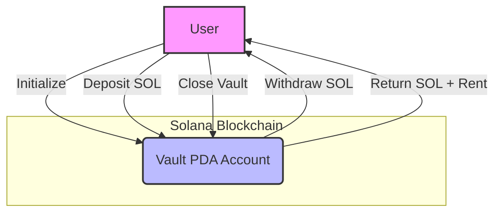

# Solana Vault Program

A simple, secure vault system built on Solana that allows users to safely store, deposit, withdraw, and manage their SOL tokens using Program Derived Addresses (PDAs).

---

## What is Vault?

**Vault** is a Solana smart contract (program) that lets users create their own secure vault accounts on-chain. Each user can deposit SOL into their vault, withdraw it at any time, and close the vault to reclaim all funds and rent. The program ensures only the vault owner can access their funds.

---

## How It Works

- **Initialize**: A user creates a vault (PDA) account, which is uniquely tied to their wallet.
- **Deposit**: The user can deposit SOL into their vault.
- **Withdraw**: The user can withdraw SOL from their vault at any time.
- **Close**: The user can close their vault, reclaiming all remaining SOL and rent.

All operations are secured by Solana's PDA mechanism, ensuring only the owner can interact with their vault.

---

## Features

- Secure, user-specific vaults using PDAs
- Deposit and withdraw SOL at any time
- Automatic rent management and account cleanup
- Built with Anchor framework for reliability and ease of use

---

## Program Flow



---

## Getting Started

1. **Clone the repository**
2. **Install dependencies**
   ```sh
   yarn install
   ```
3. **Start a local Solana validator**
   ```sh
   solana-test-validator
   ```
4. **Airdrop SOL to your wallet**
   ```sh
   solana airdrop 5 <YOUR_WALLET_ADDRESS>
   ```
5. **Build and deploy the program**
   ```sh
   anchor build
   anchor deploy
   ```

---

## Usage

- Use the provided scripts or Anchor tests to interact with the vault:
  - **Initialize**: Create your vault
  - **Deposit**: Add SOL to your vault
  - **Withdraw**: Remove SOL from your vault
  - **Close**: Close your vault and reclaim funds

---

## License

MIT 